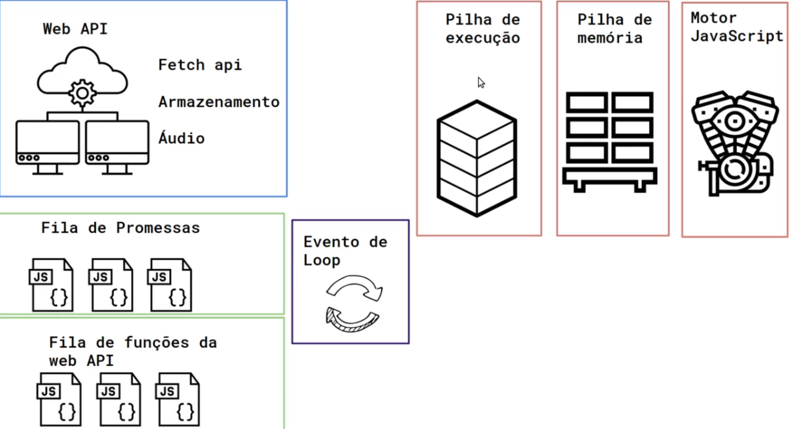

# Async/Await e Promises

- XMLHttpRequest()

  - open('verbo http', 'url')
  - send() -> envia a requisição para o servidor
  - onload -> determina uma função que será executada ao receber a resposta
  - response -> resposta do servidor, geralmente deve ser tratada com JSON.parse()
  - status -> status http

- Promise()

  - new Promise((resolve, reject) => function)
    - resolve
    - reject
  - .then()
  - .all() - > método alternativo de construir a lista de callbacks
    de uma Promise, ao passar um array de chamadas de funções para ele

- Fetch API

  - fetch(url) -> faz a request e já retorna uma promise(ou seja,
    é possível inserir um .then logo após a chamada)
    - por padrão, usa o método GET
    - para outros métodos, deve passar um argumento dentro de um
      objeto, dessa maneira:
    ```js
    fetch("http://localhost:3000/profile", {
      method: "POST",
      headers: {
        "Content-Type": "application/json",
      },
      body: JSON.stringify({
        nome: nome,
        email: email,
      }),
    });
    ```

- Browser Sync

  - browser-sync start --server --file . --host --port 5000 --startPath admin/telas/lista_cliente.html

- Json Server

  - json-server --watch db.json

- Query String e URL()
  - parâmetros chave/valor na url
  - ex.: localhost:3000/clientes?id=3
  - chave = id, valor = 3
  ```js
  const url = new URL(window.location);
  const id = url.searchParams.get(id); // obtém o parâmetro id da url exemplificada acima
  ```

# Event Loop



- [Loupe](http://latentflip.com/loupe)
- web API
  - fetch API
  - Armazenamento
  - Áudio
- código javascript puro
  - single thread
